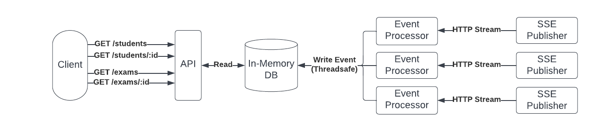

# Flask/SSE Toy Project

This is a toy project that consumes server-side events that represent hypothetical student exam scores. The student and exam data is exposed via REST using the Flask framework written in Python.


## Design



Notes:
* The application is multi-threaded, with the flask builtin dev server serving HTTP requests on the main thread, and a separate worker pool consuming SSE events.
* The SSE events are consumed over a persistent HTTP streaming connection.
* The DB is read-only from the API while the event processors have a read/write threadsafe connection.
* The DB internal storage is de-normalized to optimize the required access patterns, similar to how SQL manages indexes.
* The API does not support pagination at the moment.

## Running Locally with `pipenv`

Pipenv will manage your virtualenv for you, run the following commands.

App:
```
pipenv install -e .
pipenv run python app/main.py
```

Unit Tests:
```
pipenv run python app/tests/unit_tests.py
```

Integration Tests:
```
pipenv run python app/tests/integration_tests.py

```

## Running Locally without `pipenv`

This projects also supports a traditional `requirements.txt` file. Using a virtualenv is recommended.

App:
```
pip install -r requirements.txt
python app/main.py
```

Unit Tests:
```
python app/tests/unit_tests.py
```

Integration Tests:
```
python app/tests/integration_tests.py
```
